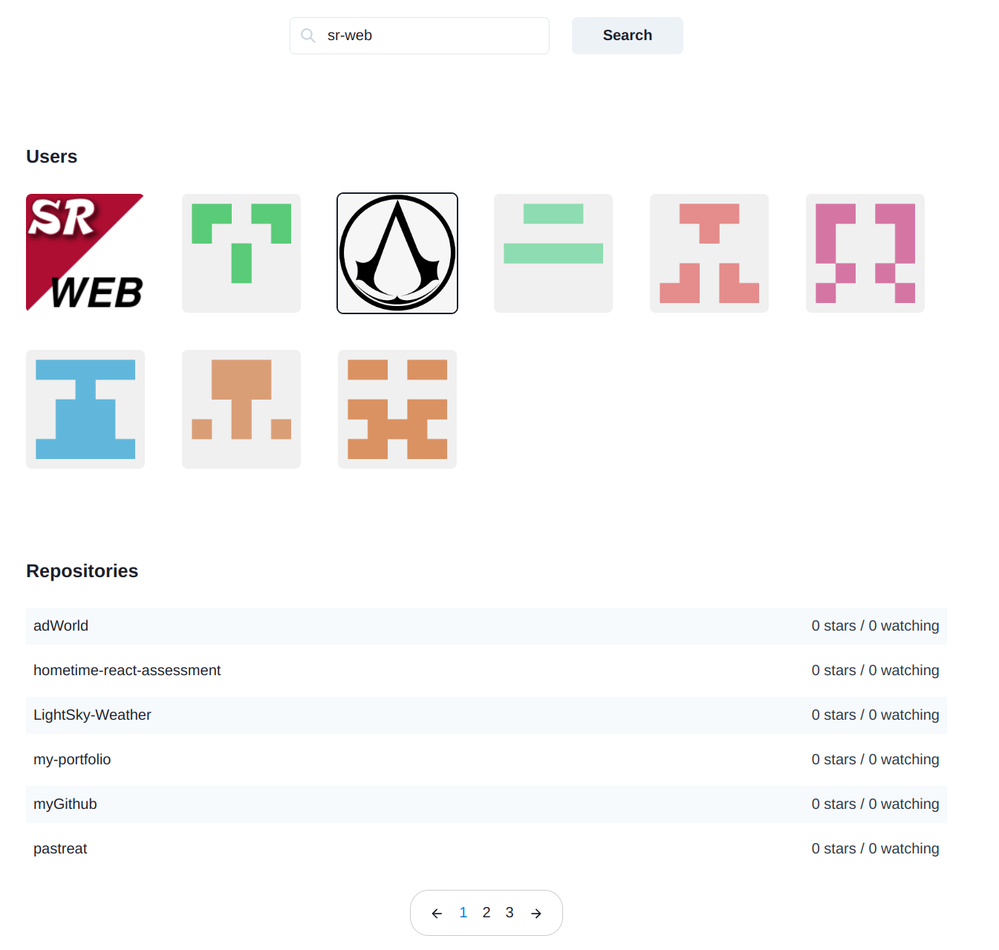
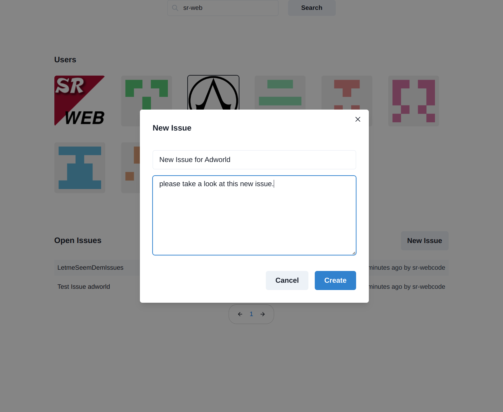
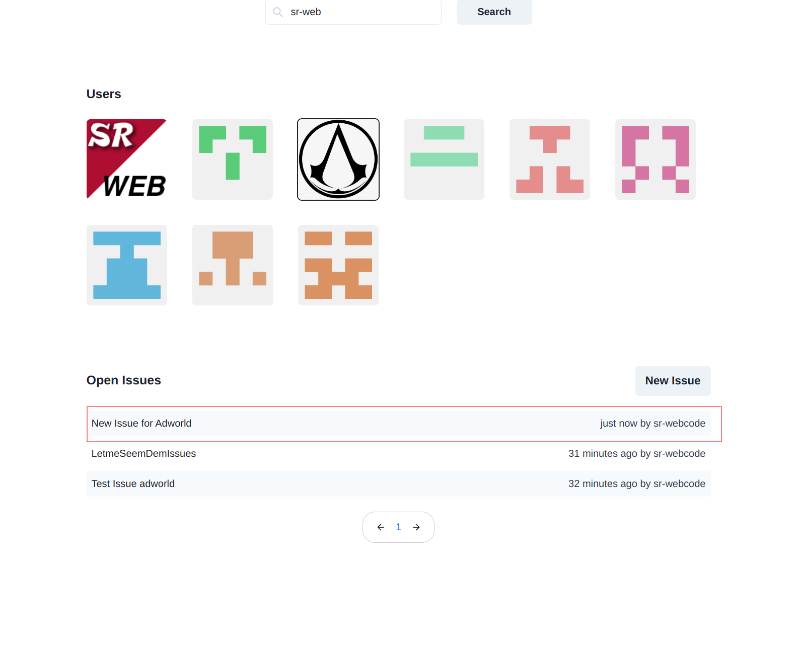
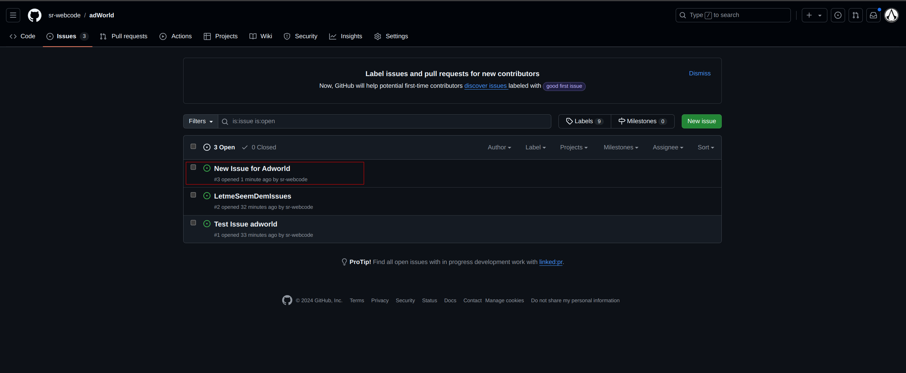

# Github Viewer

## Description
A lean implementation for searching users, repos, issues | creating issues on github using github api.

## Running the app locally

Please do the following to get started:

- Do yarn install on root directory
- Start the app by running yarn dev
- Change `VITE_GITHUB_API_TOKEN` on the `.env` file to your own github token. 
- Guide for setting up personal access token: [See Managing Github Token](https://docs.github.com/en/authentication/keeping-your-account-and-data-secure/managing-your-personal-access-tokens)

See live demo here: https://my-personal-github.netlify.app/

## Screenshots
### Searching users

### Creating issue on selected repo

### Updated issue on app

### Repo issues on github

